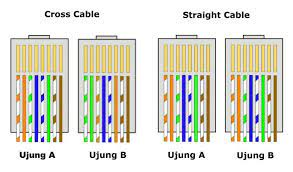
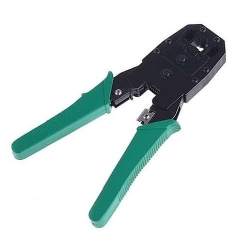
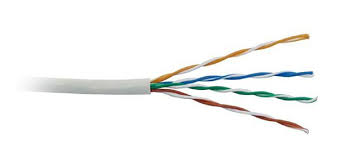
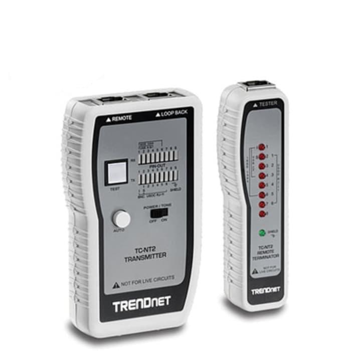

# Membuat Kabel LAN Ethernet

Contoh rangkaian kabel LAN ethernet Straight dan Cross

  

## Persiapan alat dan bahan
#### 1. Tang Crimping (Crimping Tool)

#### 2. RJ45 (Registered Jack 45)

#### 3. Kabel UTP (Unshielded Twisted Pair)

#### 4. LAN Tester

