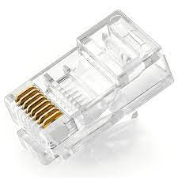

# Membuat Kabel LAN Ethernet

Contoh rangkaian kabel LAN ethernet Straight dan Cross

  

## Persiapan alat dan bahan
#### 1. Tang Crimping (Crimping Tool)

#### 2. RJ45 (Registered Jack 45)

#### 3. Kabel UTP (Unshielded Twisted Pair)

#### 4. LAN Tester

## Cara Pembuatan
#### 1. Potong kabel UTP menggunakan tang crimping sepanjang 2 meter, karena jika terlalu pendek maka kita akan susah untuk menyambungkan ke PC atau Switch.

#### 2. Kemudian potong bagian kulit kabel sehingga terlihat 8 susunan warna kabel dan urutkan sesuai kabel yang ingin kalian rangkai. Untuk susunan nya bisa dilihat di gambar contoh.

#### 3. Jika sudah disusun, ambil ujung kabel sesuai urutan dan masukkan ke RJ45.

#### 4. Lalu, kita perkuat dengan tang crimping agar saat RJ45 tidak sengaja ditarik maka tidak akan lepas.

#### 5. Untuk memastikan apakah kabel sudah terpasang semua kita harus mengetes nya dengan LAN tester. Jika pada pin-out kedapatan satu lampu tidak hidup atau loncat maka dipastikan kabel nya gagal alhasil kita harus mengulang dari awal lagi.

#### 6. Rangkaian Kabel LAN Straight

#### 7. Rangkaian Kabel LAN Cross

Kesimpulan dari proses membuat kabel LAN Ethernet adalah sebagai berikut:

1. **Keterampilan dan Ketelitian:** Proses membuat kabel LAN Ethernet memerlukan keterampilan dan ketelitian yang baik dalam memotong, menyusun, dan memasang kawat ke dalam konektor RJ45. Kesalahan kecil dalam proses ini dapat menyebabkan koneksi yang tidak stabil atau bahkan tidak berfungsi.

2. **Standar dan Spesifikasi:** Penting untuk mengikuti standar dan spesifikasi yang tepat dalam pembuatan kabel, termasuk urutan warna kawat sesuai dengan standar T568B atau T568A. Hal ini memastikan bahwa kabel yang dibuat akan kompatibel dengan perangkat dan jaringan yang digunakan.

3. **Pengujian Kualitas:** Setelah kabel dipasang, penting untuk melakukan pengujian kualitas menggunakan alat tester kabel untuk memastikan bahwa koneksi berfungsi dengan baik dan tidak ada masalah seperti kabel putus atau koneksi yang terganggu.

4. **Perhatian terhadap Detail:** Setiap langkah dalam proses pembuatan kabel LAN Ethernet memerlukan perhatian terhadap detail. Mulai dari persiapan bahan dan alat, pengupasan kabel, penyusunan kawat, hingga pemasangan konektor, setiap langkah harus dilakukan dengan cermat untuk memastikan kualitas koneksi yang optimal.

Dengan mengikuti langkah-langkah dan prinsip-prinsip tersebut, Anda dapat membuat kabel LAN Ethernet yang berkualitas tinggi dan dapat diandalkan untuk digunakan dalam jaringan lokal Anda.
